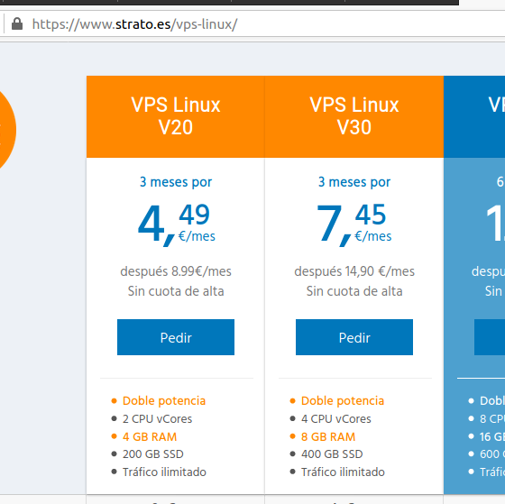
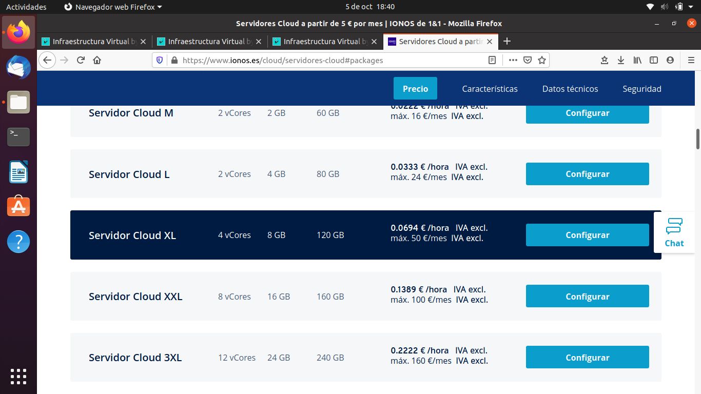
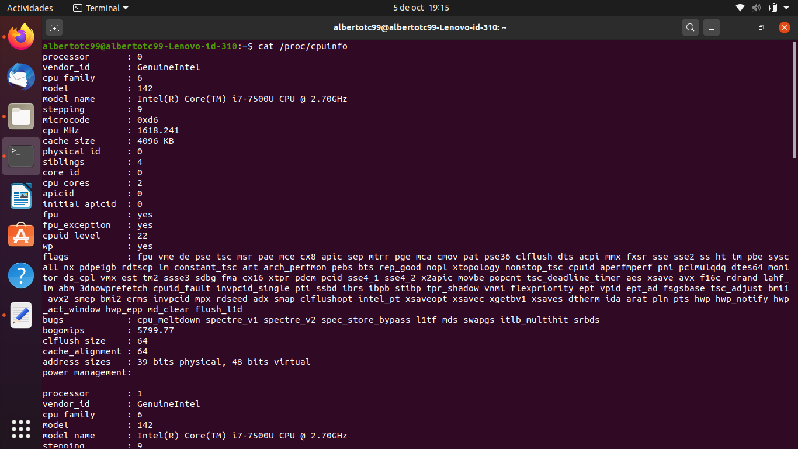
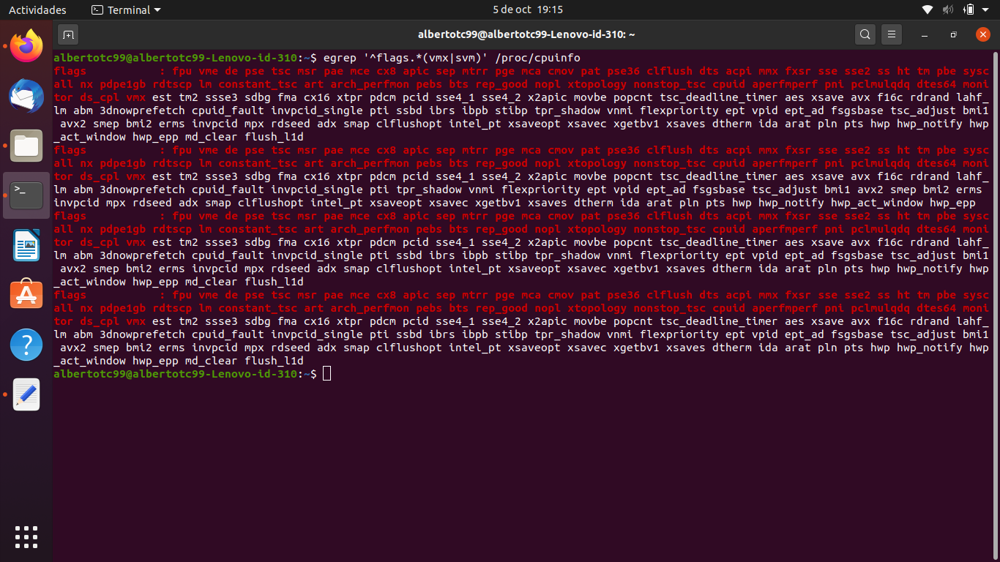
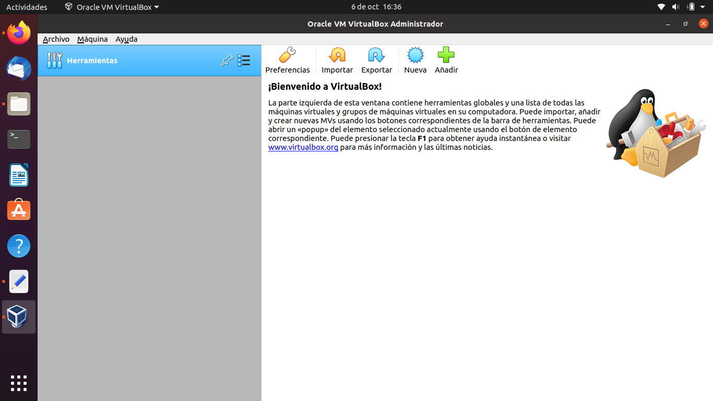
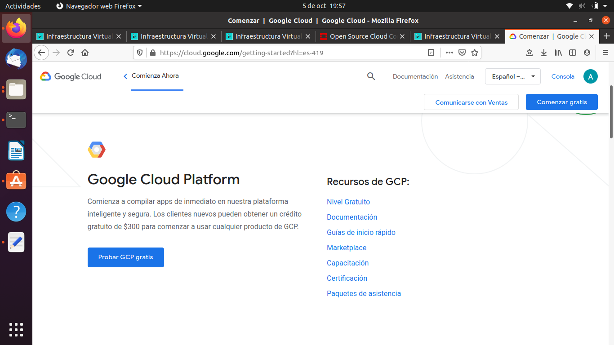

## Tema 1
___
### Ejercicio 1
*Consultar en el catálogo de alguna tienda de informática el precio de un ordenador tipo servidor y calcular su coste de amortización a cuatro y siete años. Consultar [este artículo](https://www.infoautonomos.com/consultas-a-la-comunidad/988/) en Infoautónomos sobre el tema.*

He consultado precios de ordenadores tipo servidor y he decidido el ordenador [Dell PowerEdge T340 Intel Xeon E-2124/8GB/1TB](https://www.pccomponentes.com/dell-poweredge-t340-intel-xeon-e-2124-8gb-1tb), encontrado en PC Componentes por 929€ (767'77 € sin IVA). 

 - La amortización en 4 años sería del 100/4 = 25% por año. El coste de amortización sería 929€ / 4años = **232'25 €/año**
 - La amortización en 7 años sería del 100/7 = 14'3% por año. El coste de amortización sería 929€ / 7años = **132'71 €/año**
___
### Ejercicio 2
*Usando las tablas de precios de servicios de alojamiento en Internet “clásicos”, es decir, que ofrezcan Virtual Private Servers o servidores físicos, y de proveedores de servicios en la nube, comparar el coste durante un año de un ordenador con un procesador estándar (escogerlo de forma que sea el mismo tipo de procesador en los dos vendedores) y con el resto de las características similares (tamaño de disco duro equivalente a transferencia de disco duro) en el caso de que la infraestructura comprada se usa solo el 1% o el 10% del tiempo.*

En [strato](https://www.strato.es/vps-linux/), un VPS con 4 vCores, 8 GB de RAM, 400GB SSD y tráfico ilimitado cuesta 14'90 €/mes ==> 14'90€/mes * 12meses/año = **178'8 €/año**. 

En [ionos](https://www.ionos.es/cloud/servidores-cloud#packages) un servidor en la nube con características similares (cambia el almacenamiento de 120 GB SSD en lugar de 400GB SSD) cuesta 0'0694€/hora sin IVA con máximo 50€/mes(sin IVA). 

Como solo **pagas por el tiempo de uso** voy a calcular cuánto costaría al año en los dos casos propuestos:

* Si solo se usa el 1% del tiempo: 1/100 * 0'0694€/hora * 8760horas/año = 6'08€/año. Con el 21% de IVA serían **7'36€/año** 
* Si se usase el 10% del tiempo: 10/100 * 0'0694€/hora * 8760horas/año = 60'8€/año. Con el 21% de IVA serían **73'57€/año** 

Podemos concluir que nos sale más rentable el servidor en la nube si solo lo vamos a utilizar un 10% del tiempo.
___
### Ejercicio 3
Para ver en el archivo /proc/cpuinfo mi modelo de procesador he hecho cat a este archivo. Se puede ver que mi procesador es un Intel Core i7-7500U a 2.70GHz.

Si ejecuto la orden que se proporciona en el tema y que comprueba si está la virtualización activada aparecen varias líneas, lo que confirma que tengo esta opción activada en la BIOS.

___
### Ejercicio 4
He instalado VirtualBox.

___
### Ejercicio 5
Me he metido en Google Cloud y tengo una cuenta con crédito de 300$ por ser un nuevo cliente.

